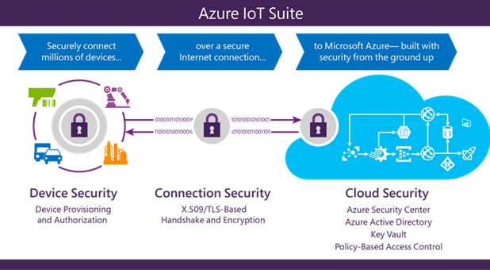

# Sicherheit von Grund Internet der Dinge

Das Internet der Dinge (IoT) stellt für Unternehmen weltweit eindeutige Sicherheit, Datenschutz und Compliance-Herausforderung. Anders als bei herkömmlichen im Internet Technologie, in dem diese Probleme im Wesentlichen Software und wie es implementiert wurde, IoT was geschieht, wenn die im Internet und die physischen Welten konvergieren betroffen ist. Schützen von IoT Lösungen erfordert sicherstellen, dass sichere Bereitstellung von Geräten, sichere Verbindung zwischen diesen Geräten und der Cloud und sichere Datenschutz in der Cloud während der Verarbeitung und Speicherung. Gegen solche Funktionalität arbeiten, sind jedoch Geräte mit eingeschränkten Ressourcen, geografische Verteilung von Bereitstellungen und eine große Anzahl von Geräten innerhalb einer Lösung.

In diesem Artikel wird erläutert, wie die Microsoft Azure IoT-Suite eine sichere und private Cloud Internet der Dinge Lösung bietet. Die Azure IoT-Suite bietet eine vollständige End-to-End-Lösung, mit der Sicherheit in jeder Phase von Grund integriert. Bei Microsoft entwickeln sicheren Software ist Teil der Softwareentwicklung praktischen unsere Jahrzehnte als Stamm der Entwicklung von sicherer Software lange auftreten. Zu diesem Zweck ist Security Development Lifecycle (SDL) der grundlegenden Entwicklungsmethodik gekoppelt mit einem Sicherheit auf Benutzerebene Infrastruktur-Diensten wie etwa betriebliche Sicherheit Assurance (OSA) und die Microsoft digitale Verbrechen Unit, Microsoft Security Response Center und Microsoft Malware Protection Center-Host. 

Der Azure IoT Suite bietet einzigartigen Merkmale von welche Stellen provisioning, Herstellen einer Verbindung mit und Speichern von Daten aus IoT Geräte einfach und transparent und die meisten alle, sichern. In diesem Whitepaper untersuchen wir die Sicherheitsfunktionen von Azure IoT Suite und Strategien für die Bereitstellung aus, um sicherzustellen, dass Sicherheit, Datenschutz und Compliance-Probleme werden behoben. 

## Einführung in die

Das Internet der Dinge (IoT) ist die Zukunft, Angebot sofortige Unternehmen sowie die Praxis Einnahmen zu senken, erhöhen und ihr Unternehmen zu transformieren der Welle. Viele Unternehmen sind jedoch zögern zum Bereitstellen von IoT in ihren Organisationen aufgrund von Bedenken hinsichtlich der Sicherheit, Datenschutz und Compliance. Ein wichtiger Punkt von Belang stammen aus der Eindeutigkeit der IoT-Infrastruktur, die die im Internet und physischen Welten zusammen Datenbankkataloge Zinsperiode zurück, diese beiden Welten einzelne Risiken. Sicherheit von IoT bezieht sich auf die Integrität der Code, der auf Geräten ausgeführt Gerät und Benutzerauthentifizierung bereitstellen, klares Ownership von Geräten (als auch Daten, die von diesen Geräten generierte) definieren und ausfallsichere im Internet und physischen Angriffen wird. 

Anschließend wird das Problem der Privatsphäre vorhanden. Unternehmen möchten über Erfassung, wie im was gesammelt werden und warum, Transparenz, anzeigen, die steuert den Zugriff und So weiter. Schließlich sind allgemeine Sicherheit des Geräts sowie die Personen, die diese Betriebssystem- und Faktoren Branchenstandards Kompatibilität zu verwalten.

Wenn die Sicherheit, Datenschutz, Transparenz und Compliance-Probleme, bleibt Auswählen der richtigen IoT Lösungsanbieter eine Herausforderung. Zusammenfügen zusammen einzelnen Bestandteile der IoT-Software und-Diensten von einer Vielzahl von Herstellern bereitgestellt werden Lücken in Sicherheit, Datenschutz, Transparenz und Compliance, die möglicherweise schwer zu erkennen, schweigen beheben vorgestellt. Die Auswahl von der richtigen IoT Software und Service Provider basiert auf der Suche nach Dienstanbieter, die verfügen über umfassende Erfahrung mit Diensten, die über vertikale Märkte und Regionen erstrecken, aber auch in der Lage sind, in einer sicheren und transparente Weise zu skalieren. In ähnlicher Weise ist es hilfreich für den ausgewählten Provider Jahrzehnte Erfahrung zur Entwicklung von sicherer Software auf Milliarden von Computern weltweit ausgeführt haben, und haben die Möglichkeit, die Verbreitung von gefährlicher Bedrohung durch diese neuen Arbeitswelt Internet Aspekte zu schätzen wissen.

## Sichere Infrastruktur von Grund 

Die [Microsoft-Cloud](https://www.microsoft.com/enterprise/microsoftcloud/default.aspx#fbid=WzBsRQi6aGk) -Infrastruktur unterstützt Kunden mehr als eine Milliarde 127 Länder/Regionen. Zeichnen auf unserer Erfahrung Jahrzehnte-Long Erstellen von Enterprise-Software und einige der größten online-Dienste in der ganzen Welt ausgeführt wird, bieten wir höheres Maß an erweiterte Sicherheit, Datenschutz, Kompatibilität und Bedrohung Risikominderung Methoden als die meisten Kunden selbst erreichen konnte.

Unsere [Security Development Lifecycle (SDL)](https://www.microsoft.com/sdl/) bietet einen obligatorische unternehmensweite Entwicklungsprozess, der in der gesamten Software-Lebenszyklus sicherheitsanforderungen einbettet. Um sicherzustellen, dass der betriebliche Aktivitäten dieselben Sicherheitsmaßnahmen führen Sie die, verwenden wir in unseren Prozess betriebliche Sicherheit Assurance (OSA) angeordnet strengen Sicherheitsrichtlinien. Wir arbeiten auch mit Drittanbieter-Audit konsolidieren zum laufenden überprüfen, dass wir unsere Auflagen erfüllen, und wir in umfassende Sicherheitsmaßnahmen durch die Erstellung von Mittellinien Betriebsprozesse, einschließlich Microsoft digitale Verbrechen Unit, Microsoft Security Response Center und Microsoft Malware Protection Center ansetzen.

## Microsoft Azure - sichere IoT Infrastruktur für Ihr Unternehmen

Microsoft Azure bietet eine vollständige Cloudlösung an, eine, das eine ständig wachsende Sammlung von integrierten Clouddiensten kombiniert – Analytics, Computer lernen, Speicherung, Sicherheit, Netzwerke und Web – mit einer branchenführenden Engagement für den Schutz und die Vertraulichkeit Ihrer Daten. Unsere Strategie [Verletzung angenommen](https://azure.microsoft.com/blog/red-teaming-using-cutting-edge-threat-simulation-to-harden-the-microsoft-enterprise-cloud/) wird ein dediziertes "rotes Team" Software Sicherheitsexperten simulieren Angriffe, testen, ob von Azure zu erkennen, gegen neue Bedrohungen schützen und Wiederherstellen aus Verstöße verwendet. Unser Team zur [globalen Vorfällen](https://www.microsoft.com/TrustCenter/Security/DesignOpSecurity) arbeitet rund um die Uhr um die Effekte der Angriffe und bösartige Aktivitäten zu verringern. Das Team folgt bewährte Verfahren Support, Kommunikation und Wiederherstellung und eDiscovery-fähigen und vorhersehbare Schnittstellen mit internen und externen Partnern verwendet.

Unsere Systeme finden Sie kontinuierliche Erkennung und Prevention, Service-Angriff Prevention, regulären Durchdringungstests und gerichtlichen Tools, mit denen identifizieren und zur Abwehr von Bedrohungen. [Mehrstufige Authentifizierung](../articles/multi-factor-authentication/multi-factor-authentication.md) bietet eine zusätzliche Sicherheitsebene für Endbenutzer auf das Netzwerk zugreifen. Und für die Anwendung und Hostanbieter bieten Steuerung des Zugriffs, Überwachung, Anti-Malware, Sicherheitsrisiken, Patches und konfigurationsverwaltung.

Microsoft Azure IoT Suite nutzt die Sicherheit und Datenschutz in der Azure-Plattform zusammen mit unsere SDL und OSA Prozesse für sichere Entwicklung und den Betrieb von allen Microsoft-Software integriert. Diese Verfahren bieten Schutz der Infrastruktur, Netzwerkschutz und Identity und Verwaltungsfeatures grundlegende für die Sicherheit einer Lösung. 

Die [Azure IoT Hub](../articles/iot-hub/iot-hub-what-is-iot-hub.md) innerhalb der [IoT Suite](../articles/iot-suite/iot-suite-what-is-azure-iot.md) bietet einen vollständig verwalteter Dienst, zuverlässige und sichere bidirektionale Kommunikation zwischen IoT Geräten und Azure-Diensten wie etwa [Azure Computer Lern-](../articles/machine-learning/machine-learning-what-is-machine-learning.md) und [Azure Stream Analytics](../articles/stream-analytics/stream-analytics-introduction.md) ermöglicht mithilfe von Sicherheitsanmeldeinformationen pro Gerät und Steuerung des Zugriffs.  

Sicherheit und in integrierten Datenschutzfeatures für die Azure IoT Suite am besten kommunizieren können, haben wir nach unten der Sammlung in drei primäre Sicherheitsbereiche aufgeteilt. 

### Sicheres Gerät-Bereitstellung und Authentifizierung

Die Azure IoT Suite schützt Geräte während, werden im Feld durch eine eindeutige Identität Schlüssel für jedes Gerät, die mit dem Gerät kommunizieren, während diese Operation wird von der Infrastruktur IoT verwendet werden kann. Der Vorgang ist schnell und einfach zu Setup. Der generierte Schlüssel mit einem Benutzer ausgewählten Geräte-ID bildet die Grundlage eines Tokens in die gesamte Kommunikation zwischen dem Gerät und dem Azure IoT Hub verwendet.

Geräte-ID können einem Gerät zugeordnet sein, während der Herstellung (d. h. in einem Hardware Vertrauensstellung Modul aktualisiert) oder eine vorhandene feste Identität als Proxy (z. B. CPU-Seriennummer) verwenden. Da diese identifizierende Informationen im Gerät ändern nicht einfach ist, ist es wichtig Einführung logischen Geräte-IDs für den Fall, dass die zugrunde liegende Gerät Hardware Änderungen, aber das logische Gerät bleibt gleich. In einigen Fällen kann die Zuordnung mit einer Identität, Gerät zum Zeitpunkt der Bereitstellung Gerät passieren (d. h. konfiguriert ein authentifizierter Feld Engineer physisch ein neues Gerät bei der Kommunikation mit dem IoT Lösung Back-End). Die [Registrierung von Azure IoT Hub Identität](../articles/iot-hub/iot-hub-devguide.md) bietet sichere Speicherung von Gerät Identitäten und Sicherheitsschlüssel für eine Lösung. Einzelpersonen oder Gruppen von Identitäten Geräte können eine Liste oder einer Sperrliste hinzugefügt werden vollständige Kontrolle über den Zugriff durch Geräte aktivieren.
 
Azure IoT Hub Zugriffsrichtlinien in der Cloud Aktivieren Aktivierung und eine Möglichkeit zum Aufheben der Zuordnung eines Geräts über IoT-Bereitstellung bei Bedarf Identität Gerät deaktivieren. Diese Zuordnung und Aufheben der Geräte Zuordnung basiert auf jedem Gerät Identität.

Die folgenden: zusätzlichen Funktionen zur gerätesicherheit

- Unerwünschte Netzwerkverbindungen annimmt Geräte nicht. Sie richten Sie alle Verbindungen und Routen in einer Weise nur ausgehende. Bei einem Gerät auf einen Befehl aus dem Back-End muss das Gerät eine Verbindung mit Überprüfen Sie für alle ausstehenden Befehle verarbeitet initiieren. Sobald eine Verbindung zwischen dem Gerät und IoT Hub sicher eingerichtet wurde, kann das Gerät in die Cloud und der Geräte aus der Cloud messaging transparent gesendet werden.  
- Geräte Herstellen einer Verbindung mit nur oder Routen zu bekannten Dienste, mit denen sie, wie etwa eine Azure IoT Hub Dies sind, herstellen.
- Auf Systemebene Autorisierung und Authentifizierung verwenden pro Gerät Identitäten, tätigen Anmeldeinformationen für den Zugriff und Berechtigungen in der Nähe-sofort widerrufen.

### Sichere Konnektivität 

Dauerhaftigkeit von messaging ist ein wichtiges Feature einer IoT-Lösung. Müssen stabil übermitteln Befehle und/oder Empfangen von Daten von Geräten wird durch die Tatsache unterstrichen, dass IoT Geräte verbunden sind, über das Internet oder anderen ähnlichen Netzwerken, die unzuverlässig sein kann. Azure IoT Hub bietet Dauerhaftigkeit der Nachrichtenübermittlung zwischen Cloud und Geräte über ein System von Empfangsbestätigungen als Antwort auf Nachrichten. Zusätzliche Dauerhaftigkeit für messaging wird durch das Zwischenspeichern von Nachrichten im IoT-Hub für bis zu sieben Tage für Telemetrie und zwei Tage für Befehle erreicht.
 
Effizienz ist wichtig, um sicherzustellen, dass Erhaltung der Ressourcen und einen optimalen Betrieb in einer Umgebung mit eingeschränkten Ressourcen. HTTPS (HTTP Secure), die sichere Industriestandard-Version des Protokolls beliebte http wird von Azure IoT Hub, aktivieren effiziente Kommunikation unterstützt. Erweiterte Message Queuing-Protokoll (AMQP) und Message Queuing Telemetrie Transport (MQTT), unterstützt von Azure IoT Hub, sind nicht nur für Effizienz im Hinblick auf die Ressourcenverwendung, sondern auch zuverlässige Nachrichtenübermittlung vorgesehen. 

Skalierbarkeit benötigen Sie sichere Zusammenarbeit mit einer Vielzahl von Geräten. Azure IoT Hub ermöglicht sichere Verbindung zu sowohl IP-fähigen und nicht-IP-fähigen Geräten. IP-fähigen Geräte können direkt her und kommunizieren mit dem IoT Hub über eine sichere Verbindung. Nicht-IP-fähigen Geräte mit eingeschränkten Ressourcen werden und nur über kurze Kommunikationsprotokolle wie Zwave, ZigBee und Bluetooth verbinden. Ein Feld Gateway wird verwendet, um diese Geräte aggregieren und führt Protokoll Übersetzung, um sichere bidirektionale Kommunikation mit der Cloud zu aktivieren.

Die folgenden: zusätzlichen Verbindung Sicherheitsfeatures

- Kommunikationspfad zwischen Geräten und Azure IoT Hub oder zwischen Gateways und Azure IoT Hub, ist Azure IoT Hub mit x. 509-Protokolls authentifiziert Industriestandard Sicherheit TLS (Transport Layer) mit gesichert.
- Um Geräte unerwünschte eingehende Verbindungen zu schützen, wird Azure IoT Hub Verbindung mit dem Gerät nicht geöffnet. Alle Verbindungen initiiert das Gerät. 
- Azure IoT Hub speichert Nachrichten für Geräte stabil und wartet darauf, dass das Gerät, eine Verbindung herzustellen. Diese Befehle werden zwei Tage gespeichert aktivieren Geräten sporadisch wegen Power oder die Verbindungen, um diese Befehle zu erhalten. Azure IoT Hub verwaltet eine Warteschlange pro Gerät für jedes Gerät.

### Sichere Verarbeitung und Speicherung in der cloud 

Von verschlüsselte Kommunikation auf Verarbeitung der Daten in der Cloud unterstützt der Azure-Suite IoT Daten zu gewährleisten. Es bietet Flexibilität, um zusätzliche Verschlüsselung und Verwaltung von Sicherheitsschlüssel zu implementieren. Mit Azure Active Directory (AAD) für die Benutzerauthentifizierung und-Autorisierung können Azure IoT Suite bereitstellen ein Autorisierungsmodells richtlinienbasierte für Daten in der Cloud Aktivierung der Verwaltung von einfachen Zugriff, die überwacht und überprüft werden können. Dieses Modell kann auch nahezu sofortige Sperrung des Zugriffs auf Daten in der Cloud und der Geräte mit der Azure-Suite IoT verbunden ist.

Sobald Daten in der Cloud befinden, können Sie verarbeitet und in jeder benutzerdefinierten Workflow gespeichert werden. Zugriff auf jeden Teil der Daten wird je nach den verwendeten Speicherdienst mit Azure Active Directory gesteuert.
   
Alle Schlüssel, die von der Infrastruktur IoT verwendet werden in der Cloud in sicherer Speicher mit der Fähigkeit, für den Fall, dass Schlüssel erneut bereitgestellt werden müssen Rollover gespeichert. Daten können in [DocumentDB](../articles/documentdb/documentdb-introduction.md) oder [SQL-Datenbanken](../articles/sql-database/sql-database-faq.md), aktivieren die gewünschte Sicherheitsstufe Definition gespeichert werden. Azure bietet darüber hinaus eine Möglichkeit zum Überwachen und prüfen alle Zugriff auf Daten aus dem Sie jede Eindringung aufmerksam gemacht werden oder nicht autorisierten Zugriff.

## Abschluss

Das Internet der Dinge beginnt mit Ihrer Dinge – die Aktionen, die für Unternehmen am wichtigsten sind. IoT bieten amazing Wert zu einem Unternehmen Kostensenkung Steigerung des Umsatzerlöses und Transformieren von Business. Erfolg der Transformation hängt weitgehend zur Auswahl des richtigen IoT-Software und Anbieters ab. Suchen einen Anbieter, der nicht nur catalyzes diese Transformation von Grundlegendes zur geschäftlichen Anforderungen und Anforderungen, sondern auch bietet Dienste und mit Sicherheit, Datenschutz, Transparenz und Compliance als wichtigsten Entwurfsaspekte erstellte Software bedeutet. Microsoft verfügt über umfassende Erfahrung mit entwickeln und Bereitstellen von sicheren-Software und-Diensten und ist weiterhin führend in diesem neuen Alter der Internet der Dinge. 

Microsoft Azure IoT Suite erstellt in Sicherheitsmaßnahmen konzipiert, Aktivieren der sicheren Überwachung Anlagen zur Verbesserung der Effizienz Laufwerk betrieblichen Innovation aktivieren und erweiterte Analytics zur Transformation von Unternehmen beschäftigen. Mit der mehrstufigen Ansatz an Sicherheit, mehrere Sicherheitsfeatures und Entwurfsmuster trägt Azure IoT Suite eine Infrastruktur Bereitstellen von vertrauenswürdigen Unternehmen umgewandelt werden kann. 

## Weitere Informationen

Jede Azure IoT Suite vorkonfigurierte Lösung erstellt Instanzen des Azure-Diensten, wie die folgenden:

- [**Azure IoT Hub**](https://azure.microsoft.com/services/iot-hub/): das Gateway für die Verbindung mit der Cloud, um "Dinge". Sie können Millionen von Verbindungen pro Hub- and -Prozess großer Datenmengen mit pro Gerät authentifizierungsunterstützung hilft Ihnen, Ihre Lösung secure skaliert.
- [**Azure DocumentDB**](https://azure.microsoft.com/services/documentdb/): skalierbarer, vollständig indiziert Datenbankdienst für halbstrukturierte Daten, die Metadaten für die Geräte verwaltet Sie bereitstellen möchten, wie Attribute, Konfiguration und Sicherheitseigenschaften. DocumentDB bietet leistungsfähige mit hohem Durchsatz Verarbeitung, Schema unabhängig Indizieren von Daten und eine umfangreiche SQL-Abfrage-Oberfläche.
- [**Azure Stream Analytics**](https://azure.microsoft.com/services/stream-analytics/): Verarbeitung in der Cloud, mit dem Sie schnell zu entwickeln und Bereitstellen einer Lösung kostengünstige Analytics um aufdecken in Echtzeit Einblicken anhand von Geräten, Sensoren, Infrastruktur und Anwendungen, in Echtzeit Stream. Die Daten aus dieser vollständig verwalteter Dienst können auf keinem Datenträger zu skalieren und gleichzeitig weiterhin hohen Durchsatz, Latenz und Flexibilität.
- [**App-Verwaltungsdienste Azure**](https://azure.microsoft.com/services/app-service/): ein Cloud-Plattform zum Erstellen von leistungsfähigen Web- und mobilen apps, bei denen eine zu Daten an einer beliebigen Stelle Verbindung; in der Cloud oder lokalen. Erstellen von mobilen apps für iOS und Android Windows ansprechender. Integrieren Sie in Ihrer Software-as a Service (SaaS) und unternehmensanwendungen mit Out-of-Box-Konnektivität zu Dutzende von cloudbasierten Diensten und unternehmensanwendungen. Code in Ihrer bevorzugten Sprache und IDE – .NET, NodeJS, PHP, Python oder Java – Web apps und APIs schneller zu erstellen.
- [**Logik Apps**](https://azure.microsoft.com/services/app-service/logic/): die Logik Apps-Feature von Azure App-Dienst unterstützt die Ihre Lösung IoT Ihre vorhandene Zeile Ihres Unternehmens integrieren und Automatisierung von Workflow-Prozessen. Logik Apps ermöglicht Entwicklern das Design Workflows, die von einem Trigger beginnt, und führen Sie dann eine Reihe von Schritten – Regeln und Aktionen, die leistungsstarken Connectors verwenden, um Ihre Geschäftsprozesse zu integrieren. Logik Apps bietet Out-of-Box-Verbindung mit einer großen Ökosystems von SaaS, Cloud-basierten und lokale Applications.
- [**Azure BLOB-Speicher**](https://azure.microsoft.com/services/storage/): zuverlässige und ökonomische Cloud-Speicher für die Daten, die die Geräte in die Cloud zu senden.

