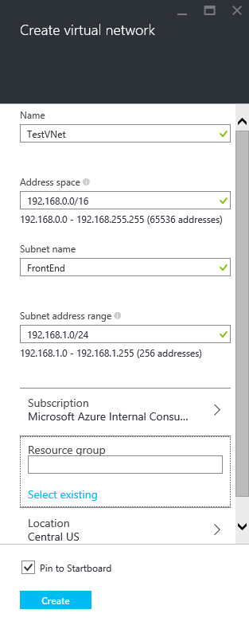

## So erstellen Sie eine VNet Azure-Portal

Führen Sie zum Erstellen einer VNet mithilfe des Portals Azure Vorschau basierend auf dem Szenario über die folgenden Schritte aus.

1. Mithilfe eines Browsers und navigieren Sie zu http://portal.azure.com und, falls notwendig, melden Sie sich mit Ihrem Azure-Konto.
2. Klicken Sie auf **neu** > **Networking** > **virtuellen Netzwerk**befinden, klicken Sie dann in der Liste **auswählen ein Bereitstellungsmodells** auf **Ressourcenmanager** , und klicken Sie dann auf **Erstellen**, wie in der folgenden Abbildung gezeigt.

    

3. Konfigurieren Sie in der Blade **virtuelles Netzwerk erstellen** die Einstellungen VNet ein, wie in der folgenden Abbildung gezeigt.

    

4. Klicken Sie auf **Ressourcengruppe** und wählen Sie eine Ressourcengruppe aus der VNet zum Hinzufügen, oder klicken Sie auf **neu erstellen** , um die VNet zu einer neuen Ressourcengruppe hinzufügen. Die folgende Abbildung zeigt die Ressource gruppeneinstellungen für eine neue Ressourcengruppe **TestRG**bezeichnet. Besuchen Sie für Weitere Informationen zu Ressourcengruppen [Azure Ressourcenmanager Übersicht](../articles/resource-group-overview.md#resource-groups)aus.

    

5. Ändern Sie bei Bedarf die Einstellungen für **Abonnement** und **einen Speicherort** für Ihre VNet. 

6. Wenn Sie nicht die VNet als Kachel in der **Startboard**finden Sie unter möchten, deaktivieren Sie **an Startboard anheften**. 

7. Klicken Sie auf **Erstellen** , und beachten Sie die Kachel mit dem Namen **Erstellen von virtuellen Netzwerk** , wie in der folgenden Abbildung gezeigt.

    

8. Warten, bis die VNet erstellt werden soll, und klicken Sie dann in das Blade **virtuellen Netzwerk** , klicken Sie auf **Alle Einstellungen** > **Subnetze** > **Hinzufügen** , wie unten dargestellt.

    

9. Geben Sie die Subnetz-Einstellungen für die *Back-End-* Subnetz aus, wie unten dargestellt, und klicken Sie dann auf **OK**. 

    

10. Beachten Sie die Liste der Subnetze, wie in der folgenden Abbildung gezeigt.

    
